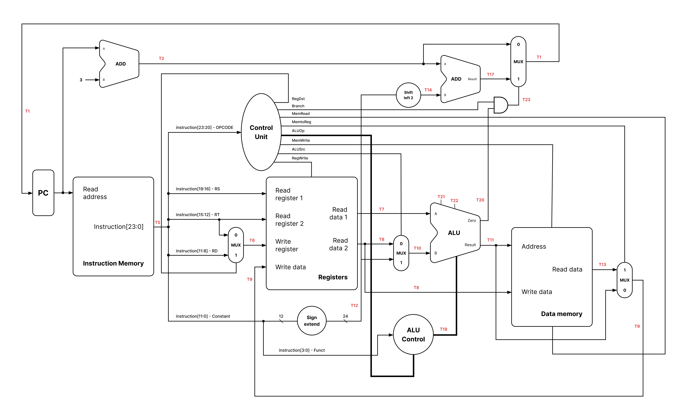

# 24bit-cpu

A team [university](https://fiek.uni-pr.edu) project focused on designing a functioning 24-bit CPU that can calculate and perform some MIPS instructions.

### Datapath visualization



### MIPS code in instruction memory

```Assembly
addi $r1, $zero, 10
addi $r2, $zero, 2

lw $r3, 0($r1)

slt $r4, $r2, $r3
beq $r4, $zero, kercimi

and $r3, $r1, $r2

kercimi: sw $r3, 4($r2)
addi $r6, $zero, $zero
```

### Contributors

- Gjon Hajdari
- Klajdi Gashi
- Kleda Gashi
- Gentrit Bytyçi
